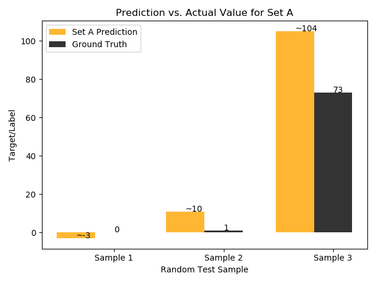

# PA1: Linear Regression

**Author:** Justin Shapiro

**Date:** January 29th, 2018

**Class:** CSCI-5800 (Special Topics: Machine Learning)

### Description
This assignment implements from scratch the Linear Regression algorithm used in Machine Learning.
**Python** with its powerful NumPy library is used to write a linear regressor that predicts
the number of comments that a Facebook post will get based on various attributes. The dataset
used to train the model is the
 [Facebook Comment Volume Dataset](https://archive.ics.uci.edu/ml/datasets/Facebook+Comment+Volume+Dataset)
 from the UCI machine learning repository.

### System Information
- **Programming Language:** Python 3.6.4 (64-bit) (*not* using Anaconda)
- **Operating System:** Windows 10 Pro
- **Architecture:** 64-bit, Intel Xeon CPU E3-1270 @ 3.80GHz

### Required Packages
- [scikit-learn 0.19.1](https://pypi.python.org/pypi/scipy/1.0.0) (for preprocessing and normalization)
- [SciPy 1.0.0](https://pypi.python.org/pypi/scipy/1.0.0) (required for scikit-learn to run)
- [NumPy 1.14.0](https://pypi.python.org/pypi/numpy/1.14.0) (for linear algebra)
- [Pandas 0.22.0](https://pypi.python.org/pypi/pandas/0.22.0) (for reading data)
- [Matplotlib 2.1.2](https://pypi.python.org/pypi/matplotlib) (for plotting results)

### Compile & Run
Make sure you run a **64-bit version** of Python 3.3 or greater version at 64-bits. The program will not work with a
32-bit version of Python because of the vectorization used to speed-up computation. Because vectorization is used,
there is often more than 4GB of RAM required to carry out operations on large matrices. Analytical vectorization is used
to find `w`, rather than a commonly-used iterative solution known as gradient descent.

Once a 64-bit version of Python 3.3 or greater is install along with the required packages listed above, start the
program with the script:

`python linear_regression.py`

## Problems

Problems 1 - 6 (excluding 5) are answered via console output. In other words, the answer to each problem is answered
during runtime. Therefore, the Python program acts as formal verification of the answers.

1. _Load the data into memory. How many samples are there in the dataset? How many attributes per sample did you see?_

    **Program output**:
    ```
    Problem #1:
    ---------------
    How many samples are there in the dataset? 40949
    How many attributes per sample did you see? 52
    ```

2. _Assume we have 𝑚 samples and𝑛 attributes per sample. Then make an appropriate 𝑋 matrix and 𝑦 vector. The dimension
of 𝑋 should be 𝑚×𝑛 and dimension of 𝑦 vector would be 𝑚×1. It is a standard practice to denote the dimensionalities by
𝑋∈𝑅𝑚×𝑛 and the column vector 𝑦∈𝑅𝑚_

    **Program output:**
    ```
    Problem #2:
    ---------------
    Given that m = 40949 and n = 52,
    Dimension of X (should be m x n+1): 40949 x 53
    Dimension of y (should be m x 1): 40949 x 1
    ```

    * Note: The `x_0 = 1` bias was added to the dataset during this problem. That is why the dimension of `X` is `n + 1`
     at this point. Because of this `w` will be a vector of length `n + 1` once it is calculated
     * The statements `assert(X.shape == (m, n + 1))` and `assert(y.shape == (m,))` succeed

3. _Prepare 3 datasets from the data you loaded in memory:_

    _a. Set the seed for the random number generator to be 123456._

    _b. Split the data at random into set A : (𝑋𝑡𝑟𝑎𝑖𝑛,𝑦𝑡𝑟𝑎𝑖𝑛) containing 80% of the samples which will be used for training, and a test set (𝑋𝑡𝑒𝑠𝑡,𝑦𝑡𝑒𝑠𝑡) containing remaining samples._

    _c. Split the data at random into set B : (𝑋𝑡𝑟𝑎𝑖𝑛,𝑦𝑡𝑟𝑎𝑖𝑛) containing 50% of the samples which will be used for training, and a test set (𝑋𝑡𝑒𝑠𝑡,𝑦𝑡𝑒𝑠𝑡) containing remaining samples._

    _d. Split the data at random into set C : (𝑋𝑡𝑟𝑎𝑖𝑛,𝑦𝑡𝑟𝑎𝑖𝑛) containing 20% of the samples which will be used for training, and a test set (𝑋𝑡𝑒𝑠𝑡,𝑦𝑡𝑒𝑠𝑡) containing remaining samples._

    **Program output:**
    ```
    Problem #3:
    ---------------
    Set A has 32759 (~80%) training samples and 8190 (~20%) testing samples
    Set B has 20474 (~50%) training samples and 20475 (~50%) testing samples
    Set C has 8189 (~20%) training samples and 32760 (~80%) testing samples
    ```

4. _For each of the A, B, C train datasets above, solve 𝑤 for the linear regression hypothesis (without a regularizer)
and predict the target values using that. Present evaluation of the prediction performance based on
SSE (Sum of squared error) metric. Draw a plot comparing performances in each of the three sets. Note: please do not use
 linear regression package functions._

    **Program output:**
    ```
    Problem #4:
    ---------------
    *** Three samples from the data have been picked randomly for testing ***
    The model for Set A has an SSE of 116.259440936381495
    The model for Set B has an SSE of 12329.7450337201926
    The model for Set C has an SSE of 1651.16832881648386
    ```

    

    

    

    

5. _Repeat problem 4, except with a 𝐿2 regularization on 𝑤 to solve for 𝑤 by setting value to the regularization
parameter to each of these four values_
    * Skipped by request

6. For each of the three training datasets A, B, C, perform normalization on each of the attributes, and repeat problem
4 and 5. For normalization please adapt the “standardization” policy.

    **Program output:**
    ```
    Problem #6:
    ---------------
    *** Three samples from the data have been picked randomly for testing ***
    The normalized model for Set A has an SSE of 5.5
    The normalized model for Set B has an SSE of 19431.5
    The normalized model for Set C has an SSE of 54.0
    ```

    

    

    

    


